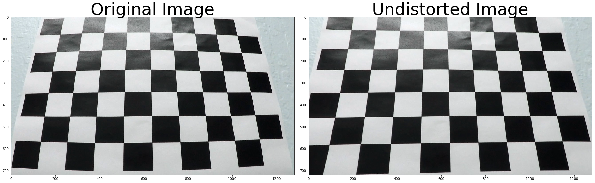
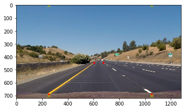
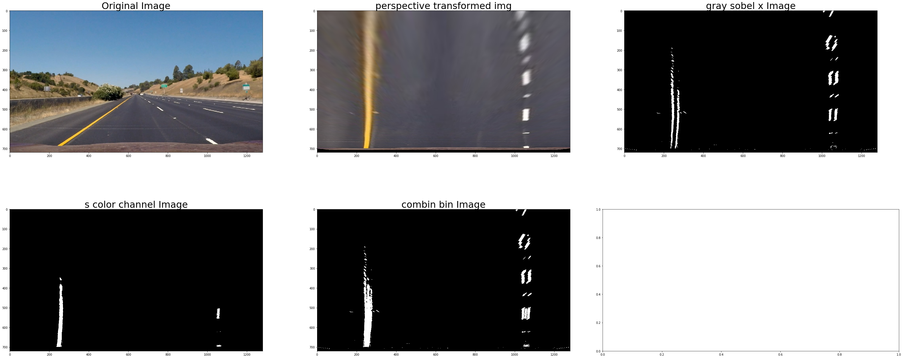
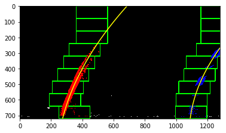
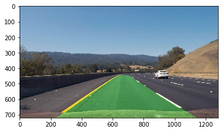

##Writeup Report


---

**Advanced Lane Finding Project**

The goals / steps of this project are the following:

* Compute the camera calibration matrix and distortion coefficients given a set of chessboard images.
* Apply a distortion correction to raw images.
* Use color transforms, gradients, etc., to create a thresholded binary image.
* Apply a perspective transform to rectify binary image ("birds-eye view").
* Detect lane pixels and fit to find the lane boundary.
* Determine the curvature of the lane and vehicle position with respect to center.
* Warp the detected lane boundaries back onto the original image.
* Output visual display of the lane boundaries and numerical estimation of lane curvature and vehicle position.

[//]: # (Image References)

[image1]: ./examples/undistort_output.png "Undistorted"
[image2]: ./test_images/test1.jpg "Road Transformed"
[image3]: ./examples/binary_combo_example.jpg "Binary Example"
[image4]: ./examples/warped_straight_lines.jpg "Warp Example"
[image5]: ./examples/color_fit_lines.jpg "Fit Visual"
[image6]: ./examples/example_output.jpg "Output"
[video1]: ./project_video.mp4 "Video"

## [Rubric Points](https://review.udacity.com/#!/rubrics/571/view) 

### Here I will consider the rubric points individually and describe how I addressed each point in my implementation.  

---

### Writeup / README

#### 1. Provide a Writeup / README that includes all the rubric points and how you addressed each one.  You can submit your writeup as markdown or pdf.  [Here](https://github.com/udacity/CarND-Advanced-Lane-Lines/blob/master/writeup_template.md) is a template writeup for this project you can use as a guide and a starting point.  


### Camera Calibration

#### 1. Compute the camera matrix and distortion coefficients. Provide an example of a distortion corrected calibration image.

The code for this step is contained in the code cell of the IPython notebook located in "./examples/solution_class.ipynb", which defined in function `get_calibration_mtx()`


I start by preparing "object points", which will be the (x, y, z) coordinates of the chessboard corners in the world. Here I am assuming the chessboard is fixed on the (x, y) plane at z=0, such that the object points are the same for each calibration image.  Thus, `objp` is just a replicated array of coordinates, and `objpoints` will be appended with a copy of it every time I successfully detect all chessboard corners in a test image.  `imgpoints` will be appended with the (x, y) pixel position of each of the corners in the image plane with each successful chessboard detection.  

I then used the output `objpoints` and `imgpoints` to compute the camera calibration and distortion coefficients using the `cv2.calibrateCamera()` function.  I applied this distortion correction to the test image using the `cv2.undistort()` function and obtained this result: 




### Pipeline (single images)

#### 1. Provide an example of a distortion-corrected image.

To demonstrate this step, I will describe how I apply the distortion correction to one of the test images like this one:
you can see the image as above session.


#### 2.  performed a perspective transform and provide an example of a transformed image.

to do a perspective transformation, firstly I select a typical img and carefully collect 2 points as a rectangle and do transformation for these points.

the image I select is the stright_lines1.jpg, the source points and destination pointsI select are: 
```python
src = np.float32([[603, 444], [675, 444], [1050, 688],[253, 688]])
dst = np.float32([[250, 0], [1050, 0], [1050, 700],[250, 700]])
```



The code for my perspective transform includes a function called `get_perspective_transform_mtx()`.

this function will return the mtx and dis required for the perspective transformation.
then in function `testimg_perspective_transform()`
it will transform the img from camera view to bird-eye view.

This resulted in the following source and destination points:

src = np.float32([[603, 444], [675, 444], [1050, 688], [253, 688]])
dst = np.float32([[250, 0], [1050, 0], [1050, 700], [250, 700]])

| Source        | Destination   | 
|:-------------:|:-------------:| 
| 603, 444      | 250, 0        | 
| 675, 444      | 1050, 0      |
| 1050, 688     | 1050, 700      |
| 253, 688      | 250, 700        |

I verified that my perspective transform was working as expected by drawing the `src` and `dst` points onto a test image and its warped counterpart to verify that the lines appear parallel in the warped image.


#### 3. Use color transforms(from RGB to HLS), gradients (sobel) to create a thresholded binary image. 

I used a combination of color and gradient thresholds to generate a binary image (see the python code  `build_binary_img()`).  Here's an example of my output for this step.




#### 4. Identified lane-line pixels and fit their positions with a polynomial


* firstly I should decide which pixels should be considered for the lane-line fitting, as there's noise even with the color filter and sobel selection.

I do a histogram calculation by function `get_histogram()`. this function will give me indiate where the left/right lane line is at the x-axis.
[histogram calculation](./report_imgs/histogram.png)

the left/right peak value x-axis is 380 and 1100, is where the lane lines are.

* secondly, I divided the image to 9 blocks on the y-axis, to find the pixels considered in each block from bottom to top.

the box width margin is 100, and box height is img_height/9. only the pixels in the box take into fitting consideration.

from bottom to up, box x-axis center position is adjusted by taking the mean value of the lower box. by this way, we can gradually update the box to make sure it contains the correct pixels, even the lane line is turning left or right.

![img with blocks][report_imgs/img_blocks.png]

* 3. lane line curve fitting

based on the selected pixels, I do a curve fitting the get the predicted lane lines.

this is done in the code function `LaneLineHandler.fitting()`



#### 5. Calculated the radius of curvature of the lane and the position of the vehicle with respect to center.

this is implemented in function
 `LaneLineHandler.calcCurvature()` as the lane line is always intend to be straignt, I use ``x = f(y)`` rather than ``y = f(x).``
the fitting curve is like:
```python
x = a*y^2 + b*y + c 
R_curve = [1 + (2a+b)^2]^(3/2)/ |2a|
```

but this R_curve is from pixel units, we need to transfer into real word meter scale.
I use the hard coded scale parameter herer:
``` python
ym_per_pix = 30/720 # meters per pixel in y dimension
xm_per_pix = 3.7/700 # meters per pixel in x dimention
```

I did this in lines # through # in my code in `my_other_file.py`

#### 6. draw back the lane line colors to the raw image
after the lane line detected, need to draw back to the raw input image.
this function is implemented in code 
```python
class LaneLineHandler():
    def drawBack():
```

we need to do a inverse perspective transformation back from the detected lane line img to the raw image, and then color the road range as green.



#### 7 merge them together as a full flow

to make the codes more compact, I use a class LaneLineHandlerer() to keep all the variables and internal images.
the function
```python
class LaneLineHandler():
    def run():
```

will consider all the flow and return the final drawback images.
this function will be used in the image lane finding and for videos.

---

### Pipeline (video)

#### 1. Provide a link to your final video output.  Your pipeline should perform reasonably well on the entire project video (wobbly lines are ok but no catastrophic failures that would cause the car to drive off the road!).

Here's a [link to my video result](./project_video.mp4)

---

### Discussion

#### 1. Briefly discuss any problems / issues you faced in your implementation of this project.  Where will your pipeline likely fail?  What could you do to make it more robust?

Here I'll talk about the approach I took, what techniques I used, what worked and why, where the pipeline might fail and how I might improve it if I were going to pursue this project further.  

