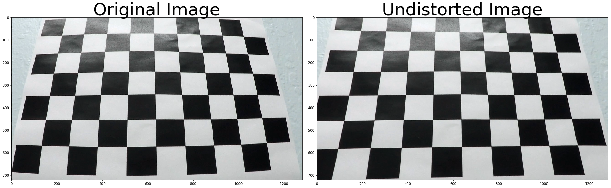
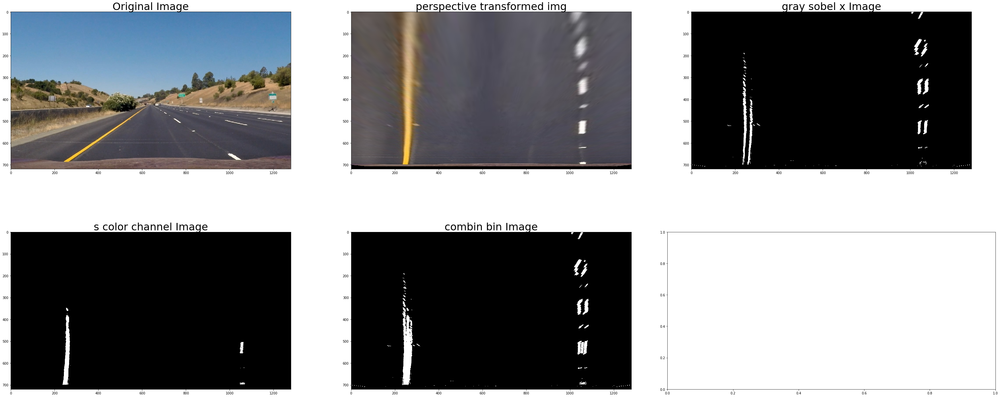

##Writeup Report


---

**Advanced Lane Finding Project**

The goals / steps of this project are the following:

* Compute the camera calibration matrix and distortion coefficients given a set of chessboard images.
* Apply a distortion correction to raw images.
* Use color transforms, gradients, etc., to create a thresholded binary image.
* Apply a perspective transform to rectify binary image ("birds-eye view").
* Detect lane pixels and fit to find the lane boundary.
* Determine the curvature of the lane and vehicle position with respect to center.
* Warp the detected lane boundaries back onto the original image.
* Output visual display of the lane boundaries and numerical estimation of lane curvature and vehicle position.

[//]: # (Image References)

[image1]: ./examples/undistort_output.png "Undistorted"
[image2]: ./test_images/test1.jpg "Road Transformed"
[image3]: ./examples/binary_combo_example.jpg "Binary Example"
[image4]: ./examples/warped_straight_lines.jpg "Warp Example"
[image5]: ./examples/color_fit_lines.jpg "Fit Visual"
[image6]: ./examples/example_output.jpg "Output"
[video1]: ./project_video.mp4 "Video"

## [Rubric Points](https://review.udacity.com/#!/rubrics/571/view) 

### Here I will consider the rubric points individually and describe how I addressed each point in my implementation.  

---

### Writeup / README

#### 1. Provide a Writeup / README that includes all the rubric points and how you addressed each one.  You can submit your writeup as markdown or pdf.  [Here](https://github.com/udacity/CarND-Advanced-Lane-Lines/blob/master/writeup_template.md) is a template writeup for this project you can use as a guide and a starting point.  

You're reading it!

### Camera Calibration

#### 1. Compute the camera matrix and distortion coefficients. Provide an example of a distortion corrected calibration image.

The code for this step is contained in the code cell of the IPython notebook located in "./examples/solution_class.ipynb", which defined in function `get_calibration_mtx()`


I start by preparing "object points", which will be the (x, y, z) coordinates of the chessboard corners in the world. Here I am assuming the chessboard is fixed on the (x, y) plane at z=0, such that the object points are the same for each calibration image.  Thus, `objp` is just a replicated array of coordinates, and `objpoints` will be appended with a copy of it every time I successfully detect all chessboard corners in a test image.  `imgpoints` will be appended with the (x, y) pixel position of each of the corners in the image plane with each successful chessboard detection.  

I then used the output `objpoints` and `imgpoints` to compute the camera calibration and distortion coefficients using the `cv2.calibrateCamera()` function.  I applied this distortion correction to the test image using the `cv2.undistort()` function and obtained this result: 





### Pipeline (single images)

#### 1. Provide an example of a distortion-corrected image.

To demonstrate this step, I will describe how I apply the distortion correction to one of the test images like this one:
you can see the image as above session.


#### 2.  performed a perspective transform and provide an example of a transformed image.

to do a perspective transformation, firstlyThe code for my perspective transform includes a function called `get_perspective_transform_mtx()`, which appears in lines 1 through 8 in the ipynb file.
.  The `warper()` function takes as inputs an image (`img`), as well as source (`src`) and destination (`dst`) points.  I chose the hardcode the source and destination points in the following manner:

```python
src = np.float32(
    [[(img_size[0] / 2) - 55, img_size[1] / 2 + 100],
    [((img_size[0] / 6) - 10), img_size[1]],
    [(img_size[0] * 5 / 6) + 60, img_size[1]],
    [(img_size[0] / 2 + 55), img_size[1] / 2 + 100]])
dst = np.float32(
    [[(img_size[0] / 4), 0],
    [(img_size[0] / 4), img_size[1]],
    [(img_size[0] * 3 / 4), img_size[1]],
    [(img_size[0] * 3 / 4), 0]])
```

This resulted in the following source and destination points:

| Source        | Destination   | 
|:-------------:|:-------------:| 
| 585, 460      | 320, 0        | 
| 203, 720      | 320, 720      |
| 1127, 720     | 960, 720      |
| 695, 460      | 960, 0        |

I verified that my perspective transform was working as expected by drawing the `src` and `dst` points onto a test image and its warped counterpart to verify that the lines appear parallel in the warped image.

![alt text][image4]

#### 3. Use color transforms(from RGB to HLS), gradients (sobel) to create a thresholded binary image. 

I used a combination of color and gradient thresholds to generate a binary image (see the python code  `build_binary_img()`).  Here's an example of my output for this step.


the raw image taken from the camera


the image after perspective transformation (from a front camera view to 'bird-eye' view)


gray scale image x axis sobel binary image


Saturation (S in HLS) channel filter image from the perspectived image


combination of S channel filter img and x-axis sobel image

#### 4. Identified lane-line pixels and fit their positions with a polynomial?

Then I did some other stuff and fit my lane lines with a 2nd order polynomial kinda like this:

![alt text][image5]

#### 5. Describe how (and identify where in your code) you calculated the radius of curvature of the lane and the position of the vehicle with respect to center.

I did this in lines # through # in my code in `my_other_file.py`

#### 6. Provide an example image of your result plotted back down onto the road such that the lane area is identified clearly.

I implemented this step in lines # through # in my code in `yet_another_file.py` in the function `map_lane()`.  Here is an example of my result on a test image:

![alt text][image6]

---

### Pipeline (video)

#### 1. Provide a link to your final video output.  Your pipeline should perform reasonably well on the entire project video (wobbly lines are ok but no catastrophic failures that would cause the car to drive off the road!).

Here's a [link to my video result](./project_video.mp4)

---

### Discussion

#### 1. Briefly discuss any problems / issues you faced in your implementation of this project.  Where will your pipeline likely fail?  What could you do to make it more robust?

Here I'll talk about the approach I took, what techniques I used, what worked and why, where the pipeline might fail and how I might improve it if I were going to pursue this project further.  

Welcome to StackEdit!
===================


Hey! I'm your first Markdown document in **StackEdit**[^stackedit]. Don't delete m


e, I'm very helpful! I can be recovered anyway in the **Utils** tab of the <i class="icon-cog"></i> **Settings** dialog.

----------


Documents
-------------

StackEdit stores your documents in your browser, which means all your documents are automatically saved locally and are accessible **offline!**

> **Note:**

> - StackEdit is accessible offline after the application has been loaded for the first time.
> - Your local documents are not shared between different browsers or computers.
> - Clearing your browser's data may **delete all your local documents!** Make sure your documents are synchronized with **Google Drive** or **Dropbox** (check out the [<i class="icon-refresh"></i> Synchronization](#synchronization) section).

#### <i class="icon-file"></i> Create a document

The document panel is accessible using the <i class="icon-folder-open"></i> button in the navigation bar. You can create a new document by clicking <i class="icon-file"></i> **New document** in the document panel.

#### <i class="icon-folder-open"></i> Switch to another document

All your local documents are listed in the document panel. You can switch from one to another by clicking a document in the list or you can toggle documents using <kbd>Ctrl+[</kbd> and <kbd>Ctrl+]</kbd>.

#### <i class="icon-pencil"></i> Rename a document

You can rename the current document by clicking the document title in the navigation bar.

#### <i class="icon-trash"></i> Delete a document

You can delete the current document by clicking <i class="icon-trash"></i> **Delete document** in the document panel.

#### <i class="icon-hdd"></i> Export a document

You can save the current document to a file by clicking <i class="icon-hdd"></i> **Export to disk** from the <i class="icon-provider-stackedit"></i> menu panel.

> **Tip:** Check out the [<i class="icon-upload"></i> Publish a document](#publish-a-document) section for a description of the different output formats.


----------


Synchronization
-------------------

StackEdit can be combined with <i class="icon-provider-gdrive"></i> **Google Drive** and <i class="icon-provider-dropbox"></i> **Dropbox** to have your documents saved in the *Cloud*. The synchronization mechanism takes care of uploading your modifications or downloading the latest version of your documents.

> **Note:**

> - Full access to **Google Drive** or **Dropbox** is required to be able to import any document in StackEdit. Permission restrictions can be configured in the settings.
> - Imported documents are downloaded in your browser and are not transmitted to a server.
> - If you experience problems saving your documents on Google Drive, check and optionally disable browser extensions, such as Disconnect.

#### <i class="icon-refresh"></i> Open a document

You can open a document from <i class="icon-provider-gdrive"></i> **Google Drive** or the <i class="icon-provider-dropbox"></i> **Dropbox** by opening the <i class="icon-refresh"></i> **Synchronize** sub-menu and by clicking **Open from...**. Once opened, any modification in your document will be automatically synchronized with the file in your **Google Drive** / **Dropbox** account.

#### <i class="icon-refresh"></i> Save a document

You can save any document by opening the <i class="icon-refresh"></i> **Synchronize** sub-menu and by clicking **Save on...**. Even if your document is already synchronized with **Google Drive** or **Dropbox**, you can export it to a another location. StackEdit can synchronize one document with multiple locations and accounts.

#### <i class="icon-refresh"></i> Synchronize a document

Once your document is linked to a <i class="icon-provider-gdrive"></i> **Google Drive** or a <i class="icon-provider-dropbox"></i> **Dropbox** file, StackEdit will periodically (every 3 minutes) synchronize it by downloading/uploading any modification. A merge will be performed if necessary and conflicts will be detected.

If you just have modified your document and you want to force the synchronization, click the <i class="icon-refresh"></i> button in the navigation bar.

> **Note:** The <i class="icon-refresh"></i> button is disabled when you have no document to synchronize.

#### <i class="icon-refresh"></i> Manage document synchronization

Since one document can be synchronized with multiple locations, you can list and manage synchronized locations by clicking <i class="icon-refresh"></i> **Manage synchronization** in the <i class="icon-refresh"></i> **Synchronize** sub-menu. This will let you remove synchronization locations that are associated to your document.

> **Note:** If you delete the file from **Google Drive** or from **Dropbox**, the document will no longer be synchronized with that location.

----------


Publication
-------------

Once you are happy with your document, you can publish it on different websites directly from StackEdit. As for now, StackEdit can publish on **Blogger**, **Dropbox**, **Gist**, **GitHub**, **Google Drive**, **Tumblr**, **WordPress** and on any SSH server.

#### <i class="icon-upload"></i> Publish a document

You can publish your document by opening the <i class="icon-upload"></i> **Publish** sub-menu and by choosing a website. In the dialog box, you can choose the publication format:

- Markdown, to publish the Markdown text on a website that can interpret it (**GitHub** for instance),
- HTML, to publish the document converted into HTML (on a blog for example),
- Template, to have a full control of the output.

> **Note:** The default template is a simple webpage wrapping your document in HTML format. You can customize it in the **Advanced** tab of the <i class="icon-cog"></i> **Settings** dialog.

#### <i class="icon-upload"></i> Update a publication

After publishing, StackEdit will keep your document linked to that publication which makes it easy for you to update it. Once you have modified your document and you want to update your publication, click on the <i class="icon-upload"></i> button in the navigation bar.

> **Note:** The <i class="icon-upload"></i> button is disabled when your document has not been published yet.

#### <i class="icon-upload"></i> Manage document publication

Since one document can be published on multiple locations, you can list and manage publish locations by clicking <i class="icon-upload"></i> **Manage publication** in the <i class="icon-provider-stackedit"></i> menu panel. This will let you remove publication locations that are associated to your document.

> **Note:** If the file has been removed from the website or the blog, the document will no longer be published on that location.

----------


Markdown Extra
--------------------

StackEdit supports **Markdown Extra**, which extends **Markdown** syntax with some nice features.

> **Tip:** You can disable any **Markdown Extra** feature in the **Extensions** tab of the <i class="icon-cog"></i> **Settings** dialog.

> **Note:** You can find more information about **Markdown** syntax [here][2] and **Markdown Extra** extension [here][3].


### Tables

**Markdown Extra** has a special syntax for tables:

Item     | Value
-------- | ---
Computer | $1600
Phone    | $12
Pipe     | $1

You can specify column alignment with one or two colons:

| Item     | Value | Qty   |
| :------- | ----: | :---: |
| Computer | $1600 |  5    |
| Phone    | $12   |  12   |
| Pipe     | $1    |  234  |


### Definition Lists

**Markdown Extra** has a special syntax for definition lists too:

Term 1
Term 2
:   Definition A
:   Definition B

Term 3

:   Definition C

:   Definition D

	> part of definition D


### Fenced code blocks

GitHub's fenced code blocks are also supported with **Highlight.js** syntax highlighting:

```
// Foo
var bar = 0;
```

> **Tip:** To use **Prettify** instead of **Highlight.js**, just configure the **Markdown Extra** extension in the <i class="icon-cog"></i> **Settings** dialog.

> **Note:** You can find more information:

> - about **Prettify** syntax highlighting [here][5],
> - about **Highlight.js** syntax highlighting [here][6].


### Footnotes

You can create footnotes like this[^footnote].

  [^footnote]: Here is the *text* of the **footnote**.


### SmartyPants

SmartyPants converts ASCII punctuation characters into "smart" typographic punctuation HTML entities. For example:

|                  | ASCII                        | HTML              |
 ----------------- | ---------------------------- | ------------------
| Single backticks | `'Isn't this fun?'`            | 'Isn't this fun?' |
| Quotes           | `"Isn't this fun?"`            | "Isn't this fun?" |
| Dashes           | `-- is en-dash, --- is em-dash` | -- is en-dash, --- is em-dash |


### Table of contents

You can insert a table of contents using the marker `[TOC]`:

[TOC]


### MathJax

You can render *LaTeX* mathematical expressions using **MathJax**, as on [math.stackexchange.com][1]:

The *Gamma function* satisfying $\Gamma(n) = (n-1)!\quad\forall n\in\mathbb N$ is via the Euler integral

$$
\Gamma(z) = \int_0^\infty t^{z-1}e^{-t}dt\,.
$$

> **Tip:** To make sure mathematical expressions are rendered properly on your website, include **MathJax** into your template:

```
<script type="text/javascript" src="https://cdn.mathjax.org/mathjax/latest/MathJax.js?config=TeX-AMS_HTML"></script>
```

> **Note:** You can find more information about **LaTeX** mathematical expressions [here][4].


### UML diagrams

You can also render sequence diagrams like this:

```sequence
Alice->Bob: Hello Bob, how are you?
Note right of Bob: Bob thinks
Bob-->Alice: I am good thanks!
```

And flow charts like this:

```flow
st=>start: Start
e=>end
op=>operation: My Operation
cond=>condition: Yes or No?

st->op->cond
cond(yes)->e
cond(no)->op
```

> **Note:** You can find more information:

> - about **Sequence diagrams** syntax [here][7],
> - about **Flow charts** syntax [here][8].

### Support StackEdit

[](https://monetizejs.com/authorize?client_id=ESTHdCYOi18iLhhO&summary=true)

  [^stackedit]: [StackEdit](https://stackedit.io/) is a full-featured, open-source Markdown editor based on PageDown, the Markdown library used by Stack Overflow and the other Stack Exchange sites.


  [1]: http://math.stackexchange.com/
  [2]: http://daringfireball.net/projects/markdown/syntax "Markdown"
  [3]: https://github.com/jmcmanus/pagedown-extra "Pagedown Extra"
  [4]: http://meta.math.stackexchange.com/questions/5020/mathjax-basic-tutorial-and-quick-reference
  [5]: https://code.google.com/p/google-code-prettify/
  [6]: http://highlightjs.org/
  [7]: http://bramp.github.io/js-sequence-diagrams/
  [8]: http://adrai.github.io/flowchart.js/
