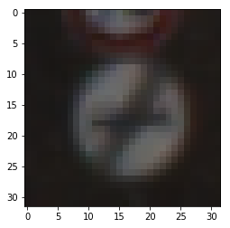
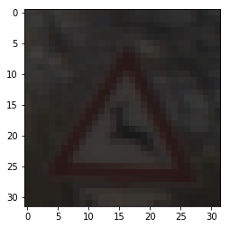
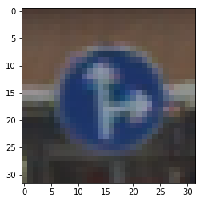
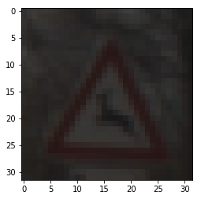
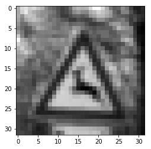

# **Traffic Sign Recognition** 

----

### 0. summary

**Build a Traffic Sign Recognition Project**

in this project, we will build a deep neural network to do traffic sign classification.

The goals / steps of this project are the following:
* Load the data set (see below for links to the project data set)
* Explore, summarize and visualize the data set
* Design, train and test a model architecture
* Use the model to make predictions on new images
* Analyze the softmax probabilities of the new images
* Summarize the results with a written report

**codes**

the raw project material can be found at:
https://github.com/udacity/CarND-Traffic-Sign-Classifier-Project/blob/master/Traffic_Sign_Classifier.ipynb, 
my work start from this materials there.

and my project codes can be found at:
https://github.com/easyfly007/CarND-Traffic-Sign-Classifier-Project/blob/master/Traffic_Sign_Classifier.ipynb

----

### 1. Data Set Summary & Exploration

In this project, I use a traffic signs data set from German Traffic Sign Dataset. 

you can download it from below link as I use, [download ](https://d17h27t6h515a5.cloudfront.net/topher/2017/February/5898cd6f_traffic-signs-data/traffic-signs-data.zip) . This is a pickled dataset in which we've already resized the images to 32x32.

I used the python list operation to calculate summary statistics of the traffic signs data set:

* The size of training set is 34799
* The size of the validation set is 4410
* The size of test set is 12630
* The shape of a traffic sign image is [32,32,3]
* The number of unique classes/labels in the data set is 43

----

#### 2.  exploratory visualization of the dataset.

below is a quick peak of the samples, to look at what they look like:

**sample 1**

this is from the # 0 train sample:

the label is **41 'End of no passing'**

**sample 2**
this is from the #233 train sample

the label is **31 Wild animals crossing**

**sample 3**
this is from the #667 train sample

the label is **31 Wild animals crossing**

**sample 4**
this is from the #908 train sample

the label is **36, Go staight or right**

we can see like the training sample #233 and #667, they show the same traffic sign, but one is brighter and one is darker.
hope our model can identify the similarity of these 2 images.

----

### 3. data pre-processing

there are something to do before we build our network and load the data into our network.

**transfer image from RGB to gray scale**

generally I will copy the LeNet structure and it use gray scale image as input

just simply use the mean of RGB as the gray scale

**input normalization**

divid the input by 255, and then subtract 0.5, then the scale will be (-0.5, 0.5).

generally this will make the input zero centered.

Here is an example of a traffic sign image, in RGB format and gray scale format.

RGB image for training sample #234

    
gray image for training sample #234

**data augment (TODO)**

actually I didn't do any augment to expand the dataset.but a reasonable augment technique would be:

* rotate the image for a small angle (<5 degree)
* add random noise
* cut the edge like this techniques

----

### 4. nentwork

firstly I copied from LeNet structure, which is as following:

* Input layer
    * size (32, 32) gray scale image
* Conv
    * kernel size (5, 5), kernel count 6, stride (1, 1) 
    * output size 6*(28, 28)
* RELU activation
* Max pooling
    * stride (2, 2)
    * output size 6*(14, 14)
* Conv
    * kernel size (5, 5), kernel count 16, stride (1, 1)
    * output size 16*(10, 10)
* RELU activation
* Max pooling
    * stride (2, 2）
    * output size 16*(5, 5)
* Flattern
    * output size 400
* Fully connect
    * output size 120 
* Drop out
    * 0.75 keep_prob for training
    * 1.0 for evaluation
* Fully connect
    * output size 43
* Softmax

this structure is copied from the classic LeNet structure (while I added drop out in the last 2 FC layers), for more detail, see below link:
http://yann.lecun.com/exdb/lenet/

**computer graph illustration**
by using tensorboard, the computer graph is as below:

---
#### 5. hyper parameters setting

the hyper parameters we selected:

**epoch**

even though the larger epoch we select, the higher accuracy (lower loss value) we will got in the training set. but in my testing, a large will induce over fitting, e.g., the accuracy becomes lower in the validation set as we train more and more.

it's because in the large epoch iterations, it's learning the the pecific features from the training set, not the general features. so need to do an early stop here.

in my testing, at the begining I use a large epoch, like 50 epoch, and then I find the validation accuracy stopped increasing after 15 .
based on this, I use the final epoch number 15.

**learning rate**

learning rate is not a big problem, if you are not sure which one to use, start from the stardard 0.001, and a samll one will always induce a better result except need larger epoch numbersd.

in my case, I select 0.001.

**batch size**

it's based on your machine memory size.

if accept, select a larger one.

I selet 128.

it's OK in my PC, the only problem is that when in the fine tuning step, after several try, the memory depleted and I will need to restart the kernel to clean on the memory.

do a random shuffle before each epoch.

**optimizer**

I select the AdamOptimizer, rather than GradientDescentOptimizer,
as for GradientDescentOptimizere, it may stuck on the local minimum point there.

----
### 6. the final solution 

in my LeNet structure training, I finally got an validation accuracy near 90%, not good enough, and the similar validation accuracy.

I am thinking maybe my structure is under fitting, we need a more poerful structures.

then I use a more complicated network, as below:

* input layer
    * size (32, 32)
* conv1
    * kerenel size (3,3), kernel count 16, stride (1, 1)
    * output size 16*(30, 30)
* RELU activation
* conv2
    * kernel size (3, 3), kernel count 32, stride (1, 1)
    *  output size 32*(28, 28) 
* RELU activation
* max_pooling
    * kernel size (2, 2), stride (2, 2)
    * output size 32*(14, 14)
* conv3
    * kernel size (3, 3), kernel count 64, stride (1, 1)
    * output size 64*(12, 12)
* RELU activation
* max_pool
    * kernel size (2, 2), stride (2, 2)
    * output size 64*(6, 6)
* conv4
    * kernel size (3,3), kernel count 64, stride (1, 1)
    * output size 64*(4, 4)
* RELU activation
* max_pool
    * kernel size (2, 2), stride (2, 2)
    * output size 64*(2, 2)
* Flatten
    * output size 256
* fully connect
    * output size 128
* RELU activate
* drop out
    * keep prob = 0.75
* fully connect
    * output size 64
* RELU activate
* drop out
    * keep prob = 0.75
* fully connect
    * output size 43

**my final result is**
* training set accuracy of 0.893
* validation set accuracy of 0.872
* test set accuracy of 0.863

----
### model evaluation on the new images 
####1. Discuss the visual output of your trained network's feature maps. What characteristics did the neural network use to make classifications?
