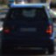
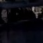
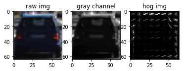

##Writeup report for vehicle detection project

---

** Vehicle Detection Project**

The goals / steps of this project are the following:

* Perform a Histogram of Oriented Gradients (HOG) feature extraction on a labeled training set of images and train a classifier Linear SVM classifier
* Optionally, you can also apply a color transform and append binned color features, as well as histograms of color, to your HOG feature vector. 
* Note: for those first two steps don't forget to normalize your features and randomize a selection for training and testing.
* Implement a sliding-window technique and use your trained classifier to search for vehicles in images.
* Run your pipeline on a video stream (start with the test_video.mp4 and later implement on full project_video.mp4) and create a heat map of recurring detections frame by frame to reject outliers and follow detected vehicles.
* Estimate a bounding box for vehicles detected.

[//]: # (Image References)
[image1]: ./examples/car_not_car.png
[image2]: ./examples/HOG_example.jpg
[image3]: ./examples/sliding_windows.jpg
[image4]: ./examples/sliding_window.jpg
[image5]: ./examples/bboxes_and_heat.png
[image6]: ./examples/labels_map.png
[image7]: ./examples/output_bboxes.png
[video1]: ./project_video.mp4

## [Rubric](https://review.udacity.com/#!/rubrics/513/view) Points

---

### Writeup / README

* Provide a Writeup / README that includes all the rubric points and how you addressed each one.  You can submit your writeup as markdown or pdf.  [Here](https://github.com/udacity/CarND-Vehicle-Detection/blob/master/writeup_template.md) is a template writeup for this project you can use as a guide and a starting point.  

### Histogram of Oriented Gradients (HOG)
* Explain how (and identify where in your code) you extracted HOG features from the training images.

The code for this step is contained in the first code cell of the IPython notebook.  

I started by reading in all the `vehicle` and `non-vehicle` images.  Here is an example of one of each of the `vehicle` and `non-vehicle` classes:

I then explored different color spaces and different `skimage.hog()` parameters (`orientations`, `pixels_per_cell`, and `cells_per_block`).  I grabbed random images from each of the two classes and displayed them to get a feel for what the `skimage.hog()` output looks like.

Here is an example using the `Gray` color space and HOG parameters of `orientations=8`, `pixels_per_cell=(8, 8)` and `cells_per_block=(2, 2)`:

#### 2. Explain how you settled on your final choice of HOG parameters.

I tried various combinations of parameters, like the RGB, YCrCb, Gray
finally I selected YCrCb and combine all the 3 channel together.
the parameter I used for hog is:
orient = 9, pix_per_cell = 8, cell_per_block = 2 

#### 3. Describe how (and identify where in your code) you trained a classifier using your selected HOG features (and color features if you used them).

in this case, I use svm as my classifier.

there's some parameters to tune, like the C and kernel type.
I selecte the linear kernel, and tunned C = 0.02, loss = 'hinge'

for the dataset build, I selected all the vehicle and non-vehicle png images.
then I do normalizes them to make sure all the features (from hog, color space spatial, color histogram)
has the same scale.

then I shuffle the dataset, make the car and not car samples randomly distributed.

after that, I split the dataset, 80% for traning, 20 for testing.
the tested accuracy is 99.78% which seems quite good.

the classifier and scaler will be used for the video image processing,
so I use pickle to save them to avoid retrain when I continue the project nexttime.

### Sliding Window Search

#### 1.  implemented a sliding window search.

the training image is small size and has only car (if label as positive)
so I did a sliding window method to check if the car detected in each window.

the basic windows size  is (64, 64), and it can be scalled as 1.0, 1.5, 2.0, 2.5 to detect larger cars.

smaller window sliding range is from the road end to bottom, while the larger window is alitter lower.
it's reasonable that the nearer car will appear larger in the img.

I use the y range for each scale is:
scale = 1.0, y range = [380, 550]
scale = 1.5, y range = [400, 600]
scale = 2.0, y range = [400, 650]
scale = 2.5, y range = [400, 650]

![alt text][image3]

#### 2. pipe line for image vehicle detection

Ultimately I searched on two scales using YCrCb 3-channel HOG features plus spatially binned color and histograms of color in the feature vector, which provided a nice result.  Here are some example images:

then I applied multi scaled windows sliding search of cars in the  input image.

I calculated heat map for the car detection, using threshold = 2 to select the space that I use to make car bbox.
label function from scipy.ndimage.measurements is used to make the range of the cat detection.

then this raw image with the final rectangle are saved in the output_images folder, with the same file name.

---

### Video Implementation

#### 1. final video output
the final video result is test_solution.mp4 and test_solution2.mp4, which used different method.

#### 2. Describe how (and identify where in your code) you implemented some kind of filter for false positives and some method for combining overlapping bounding boxes.

firstly I used the same function like image_processing() to get the vehicle detection in the video, just treat the images for each frame
individually.

we can see the result is not very good.

I then try to consider the continuous frame together,
I used accumulated_heat_map to keep the previous frame detected card, and add the new frame heat map to do a final decision.
the accumulated_heat_map will be decayed with a factor of 0.6 for each frame, so the far away old frame image result will has lower affection.
by this result it's better than the first result
you can compare test_slution.mp4 and test_solution2.mp4 and find the result.

---

### Discussion

*  for speed up, I use the pickle to dump necessary information like the classifier and scaler that I will used next time.
* also for speed up, as recommended by in the course, I firstly calculated the hog matrix then apply the windows sliding.
this can save times when the windows has overlap.
*  the difficult part is hwo to select the efeatures, it will decide your project fail or succeed.
I learned from the class suggestion and used YCrCb as the color space and it seems OK.
* my concern: as we can see the feature length will be as large as 8460, but we only have 8968 not car samples and 8792 car samples.
 will it be over fitting? I am not quite sure, but the test accuracy is good, so I guess that the features are actually not so much,
I mean the features are related, not independent each other.
* for debugging in the video image process functions, I try to save the middle image in a folder that I can check how this pipe like works.
it's great helpful for my work.
